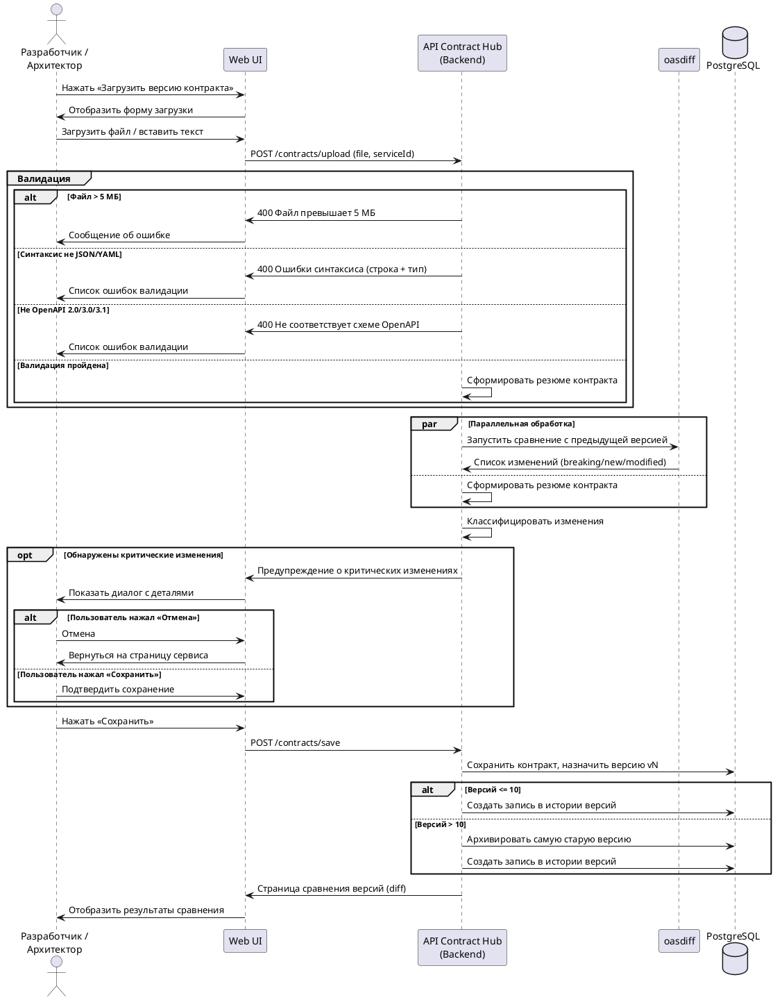

:::info Шаблон
Этот файл является шаблоном. Вставьте диаграммы в отмеченные места и дополните описание.
:::

Sequence-диаграммы описывают взаимодействие компонентов системы во времени для ключевых сценариев MVP.

## Загрузка контракта и обнаружение изменений {#seq-upload}

Диаграмма охватывает полный поток: загрузка файла → валидация → параллельное сравнение через `oasdiff` → предупреждение при критических изменениях → сохранение с управлением историей.

Ключевые архитектурные решения, отражённые в диаграмме:

- Параллельная обработка (`par`) — `oasdiff` запускается одновременно с формированием резюме контракта, что укладывается в NFR-001 (≤ 3 с для сравнения).
- Управление историей через `alt` — архивирование самой старой версии при превышении лимита в 10 версий реализует BR-017 прямо на уровне сохранения.
- Диалог подтверждения (`opt`) активируется только при критических изменениях — не блокирует разработчика при безопасных правках.
