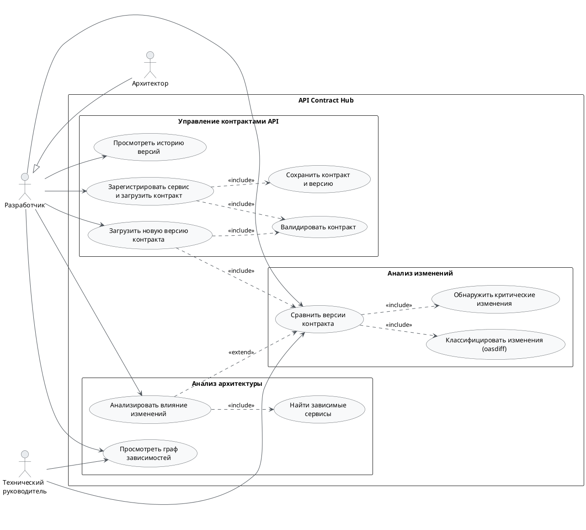

Диаграмма показывает акторов системы и их взаимодействие с функциями API Contract Hub в рамках MVP v1.0.

## Диаграмма {#diagram}

## Акторы системы {#actors}

| Актор | Роль в системе | Use Cases |
|-------|---------------|-----------|
| Разработчик серверной части | Основной пользователь. Регистрирует сервисы, загружает контракты, анализирует изменения | UC-001, UC-002, UC-003, UC-004, UC-005 |
| Архитектор решений | Дополнительный актор с расширенными правами. Видит всю архитектуру, выполняет откат версий | UC-001, UC-002, UC-003, UC-004, UC-005 |
| Технический руководитель команды | Просматривает граф зависимостей и статус контрактов команды | UC-003 |

## Описание Use Cases {#use-cases}

Детальные спецификации каждого Use Case описаны в разделе [Функциональные требования](../Требования/functional-requirements).

| ID | Название | Приоритет |
|----|---------|----------|
| UC-001 | Регистрация нового сервиса и загрузка OpenAPI-контракта | Must Have |
| UC-002 | Сравнение версий контракта и обнаружение критических изменений | Must Have |
| UC-003 | Просмотр графа зависимостей сервисов | Must Have |
| UC-004 | Анализ влияния изменений на зависимые сервисы | Should Have |
| UC-005 | Просмотр истории версий контракта | Should Have |

## Границы системы {#system-boundaries}

**Внутри системы:** управление реестром контрактов, сравнение версий, граф зависимостей, анализ влияния, история версий, аутентификация.

**Вне системы:** контрактное тестирование (Pact), мониторинг производительности (Prometheus/Grafana), управление шлюзом API, уведомления (v2.0).
