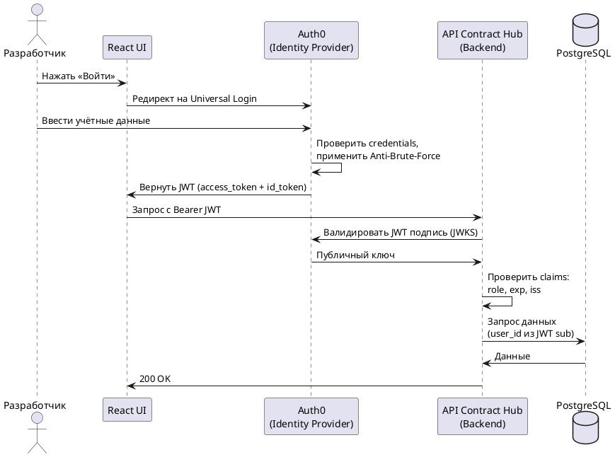

## Замена собственной реализации готовым внешним сервисом {#replacement}

### Выбранная функциональность: аутентификация и управление доступом {#chosen-feature}

В текущей документации описано, что система реализует аутентификацию самостоятельно: JWT-токены, хэширование паролей, блокировка при переборе, ролевая модель. В NFR-006 прямо зафиксировано, что единый вход (SSO через LDAP/SAML/OAuth) запланирован на версию 2.0, то есть текущая реализация заведомо временная и потребует переписывания.

Аутентификация не является основной ценностью продукта — ею являются анализ API-контрактов и граф зависимостей. При этом собственная реализация несёт полный груз сопровождения: уязвимости, токены, хранение паролей, политики блокировки. Для команды из двух разработчиков это нецелесообразная трата ресурсов.

### Решение: Auth0 {#auth0}

**Auth0** — облачный сервис управления идентификацией и доступом (Identity-as-a-Service). Вместо реализации аутентификации с нуля система делегирует её Auth0 и получает готовую инфраструктуру.

| Требование из NFR-006 | Как закрывается через Auth0 |
|-----------------------|-----------------------------|
| JWT-токены с настраиваемым сроком жизни | Генерируются и валидируются Auth0; TTL настраивается в консоли без кода |
| Безопасное хранение паролей | Обрабатывается платформой; разработчик не касается этого слоя |
| Блокировка при переборе паролей | Встроенная защита от перебора включается одной настройкой |
| Ролевая модель (разработчик / архитектор) | Роли и разрешения настраиваются в интерфейсе Auth0; передаются внутри токена |
| Единый вход (запланирован на v2.0) | Подключение корпоративного каталога (LDAP, Active Directory, SAML) не требует изменений в коде приложения — только конфигурация в Auth0 |
| Аудит-лог операций входа (NFR-007) | Auth0 хранит полную историю событий аутентификации |

**Стоимость.** Для 110 пользователей подходит бесплатный тариф Auth0 (до 7 500 активных пользователей в месяц). При переходе к корпоративным функциям (единый вход) — платный тариф от $240 в месяц.

:::tip Эффект замены
Переход на Auth0 освобождает 20–30 часов разработки, исключает необходимость переписывать аутентификацию в v2.0 и снижает поверхность потенциальных уязвимостей. Таблица `users` в PostgreSQL упрощается: исчезают поля `password_hash`, `failed_login_count`, `locked_until`.
:::

### Схема интеграции с Auth0 {#auth0-integration}

## Стратегия платформизации API Contract Hub {#platformization}

### Почему продукт можно вывести на рынок {#market-opportunity}

Проблема несогласованных изменений API в микросервисной архитектуре не уникальна для ООО «ПринтСтройМонтажСервис». С ней сталкивается любая компания, у которой больше десяти микросервисов и нескольких независимых команд разработки.

Анализ конкурентов показывает: ни одно существующее решение не совмещает все четыре функции в одном продукте.

| Решение | Реестр контрактов | Автоматический анализ изменений | Граф зависимостей | Анализ влияния |
|---------|:-----------------:|:-------------------------------:|:-----------------:|:--------------:|
| SwaggerHub | ✓ | Частично | — | — |
| Pact Broker | ✓ | Частично | Частично | — |
| Postman | Частично | — | — | — |
| **API Contract Hub** | **✓** | **✓** | **✓** | **✓** |

### Целевые сегменты рынка {#target-segments}

**Основной сегмент — технологические компании среднего размера.** 50–500 инженеров, 20–200 микросервисов, несколько продуктовых команд. Они достаточно большие, чтобы проблема несогласованных API была острой, но недостаточно большие, чтобы строить собственный инструмент силами выделенной платформенной команды. Типичные представители: финтех, e-commerce, SaaS-компании с разделённым бэкендом.

**Дополнительный сегмент — крупные компании в стадии перехода с монолита на микросервисы.** Они активно «распиливают» существующие системы и особенно нуждаются в инструменте, который помогает видеть зависимости и контролировать изменения контрактов в процессе миграции.

**Перспективный сегмент — регулируемые отрасли** (банки, государственные IT-системы). Для них критичны аудит изменений и возможность развернуть систему в собственной инфраструктуре. Архитектура на Docker/Kubernetes это уже поддерживает.

### Бизнес-модель {#business-model}

Продукт продаётся компаниям, а не физическим лицам: разработчики — пользователи, решение о покупке принимает IT-руководство (CTO, VP Engineering). Это классическая схема **B2B** без дополнительных посредников.

Выбранный подход монетизации — **ежемесячная или ежегодная подписка** с тарифными планами. Ценовая метрика — количество зарегистрированных сервисов: по мере роста микросервисной экосистемы клиент естественно переходит на следующий тариф.

| Тариф | Цена | Для кого | Ограничения |
|-------|------|---------|------------|
| Старт | 15 000 руб./мес. | Небольшие команды, пилоты | До 25 сервисов, без SSO |
| Рост | 45 000 руб./мес. | Масштабирующиеся компании | До 100 сервисов, базовый SSO, доступ к API |
| Корпоративный | от 115 000 руб./мес. | Крупные компании | Без ограничений, корпоративный SSO, SLA, выделенная поддержка |
| Собственная инфраструктура | единоразово + поддержка | Регулируемые отрасли | Развёртывание в инфраструктуре клиента |

Дополнительный источник дохода — **платное внедрение**: помощь в импорте существующих спецификаций из множества репозиториев, настройка интеграций с конкретным CI/CD-стеком клиента.

### Стратегия выхода на рынок {#go-to-market}

**Этап 1 — рост через продукт (PLG).** Бесплатный доступ для небольших команд и проектов с открытым исходным кодом. Разработчики-энтузиасты, попробовавшие продукт, становятся его сторонниками внутри своих компаний и инициируют покупку снизу вверх. Это снижает стоимость привлечения клиента и органически формирует репутацию.

**Этап 2 — прямые продажи корпоративному сегменту.** Подтверждённые цифры экономии (снижение инцидентов, сокращение времени на анализ изменений) становятся аргументом для переговоров с IT-руководством.

### Устойчивость конкурентного преимущества {#competitive-advantage}

Главный риск состоит в том, что крупные игроки (SmartBear/SwaggerHub) могут закрыть функциональный разрыв. Устойчивое конкурентное преимущество — не отдельные функции, а их интеграция в единый рабочий процесс: загрузил контракт → увидел критические изменения → увидел, кто пострадает → получил контакты владельцев. Воспроизвести такой опыт сложнее, чем добавить одну функцию.

Дополнительные барьеры входа:

- **Данные о зависимостях** — накапливаются со временем и имеют ценность как граф архитектуры всей организации. Миграция к конкурентам означает потерю этого актива.
- **Глубокая интеграция в CI/CD** (v2.0) — после встраивания в пайплайн замена требует изменений во всех репозиториях.
- **Сетевой эффект** — чем больше команд используют систему, тем точнее граф зависимостей и тем ценнее анализ влияния для каждой команды.
